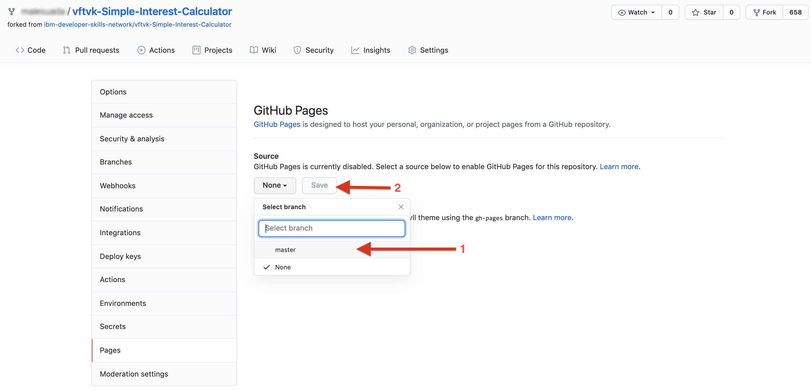
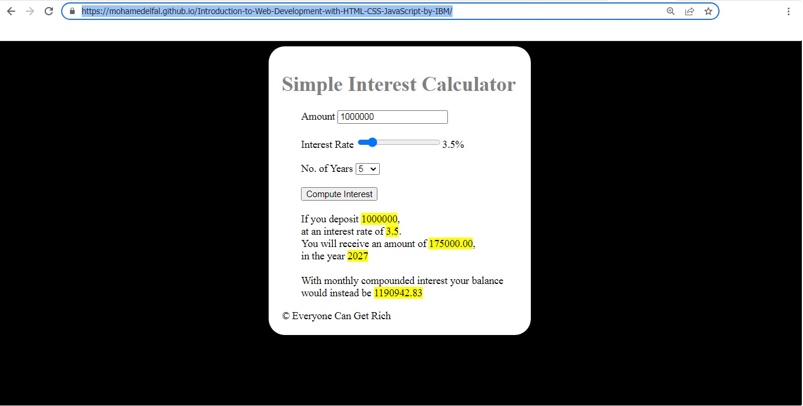

# Introduction to Web Development with HTML CSS JavaScript by IBM
## Final Project
## table of contents
* [Final Project: Details](#final-project-details) *[file](./Final-Project-Details.md)*
* [Final Project: Preparation-and GitHub Setup](#project-preparation) *[file](./Final-Project-Preparation-and-GitHub-Setup.md)*
* [Starter Code]() *[starter code FILES](./starter-code/)*
* [Sulation](#solution) *[WebPage]( https://mohamedelfal.github.io/Introduction-to-Web-Development-with-HTML-CSS-JavaScript-by-IBM/)*

# Final Project: Details 
## Project - Simple Interest Calculator

**Everyone Can Get Rich** is a non governmental charity organization.   
This NGO works to improve the financial literacy of the common people.   
They have hired a developer to create an online application.   
This app titled Simple Interest Calculator, will compute the interest one can earn given the amount you wish to save, the number of years you can keep it invested and the interest rate the bank would pay you.  

The NGO is very particular about the way the app looks including the colors and the alignment of the form elements.  
The NGO wants the app to look exactly like this.  

  

When a user enters 1000000 as amount, 3.5 as rate of interest and 5 as No.   
of years, and clicks the Compute button, an amount of 175000 must be displayed as interest.  

  

The developer who was hired for this task, left it incomplete. As you can see in the below image, it is no where close to what the NGO wanted.  
The elements are not properly aligned. The colors are not professional. And the computation is not yet implemented.  

  

The NGO has now approached you to get this app completed. Are you ready to help them?  

**Objectives**  

Download the source code.  
Modify the html file as per requirements.  
Modify the css file as per requirements.  
Modify the javascript file as per requirements.  
Verify if the app is working properly.  
Upload to GitHub.  
Share the link for peer review.  

# Project Preparation
Your task is to develop a web application that looks as follows:

The application calculates the simple interest after the user enters the principle, interest rate and the duration in years. For example, if the user enters 1000000 as amount, 3.5 as rate of interest and 5 as No. of years, the following message is shown after the user clicks on the "Compute Interest" button.

If you deposit 1000000,
at an interest rate of 3.5%.
You will receive an amount of 175000,
in the year 2025

Some work has already been done on the project and it currently looks as follows:

Now that you know what has to be done. Let us prepare the environment for you to get started.

## Objectives
* 1- Fork the project.
* 2- Create GitHub pages to publish the project.

## Exercise 1 : Fork the project
* 1- Login to your GitHub.
* 2- Fork the repo at https://github.com/ibm-developer-skills-network/vftvk-Simple-Interest-Calculator

* 3- You will now have your own copy of the repository to work on.

* 4- Verify that you see the following three files in your repository.

  * 1- index.html
  * 2- style.css
  * 3- script.js

## Exercise 2 : Publish on GitHub pages
**GitPages** allows you to publish the content on your git repo as a web site, which can be accessed by anyone on the internet.

You can use this feature to publish any of your projects. Let us create a URL for the project you are about to complete.

* 1- Navigate to your project repo.(The one you have forked earlier)

* 2- Go to the settings page.

* 3- Scroll down to the GitHub Pages section.

* 4- Select the master branch source and click on the Save button.

* 5- You will see the URL for your repository.

*If your git username is watson34 and reponame is vftvk-Simple-Interest-Calculator, your URL would be http://watson34.github.io/vftvk-Simple-Interest-Calculator*

* 7- When you open this URL in a browser you should see the unfinished Simple Interest Calculator project. If you get '404' error page, please be patient. It may take upto 60 minutes for the website to show up after you have created the URL.

* 8- Save this URL. You will asked to submit this URL for peer review **that comes next in the course.**

## I have forked [here](https://github.com/mohamedelfal/vftvk-Simple-Interest-Calculator)

## Starter Code

**Click *[here](./starter-code/)* to open Starter Code Folder**

**Click *[here]( https://mohamedelfal.github.io/Introduction-to-Web-Development-with-HTML-CSS-JavaScript-by-IBM/starter-code/)* To Open Starter Code WebPage**

## solution
   
 
 
**Click *[here]( https://mohamedelfal.github.io/Introduction-to-Web-Development-with-HTML-CSS-JavaScript-by-IBM/)* To Open solution WebPage**

# ***that's all***
# ***Mohamed Antar Abdelhadi***
